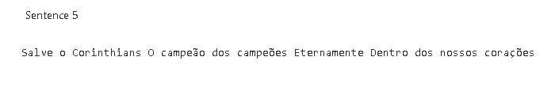

# Analyze text with Language Studio
This repository is a copy to [Microsoft Learn](https://microsoftlearning.github.io/mslearn-ai-fundamentals/Instructions/Labs/06-text-analysis.html).

In this exercise you will explore the capabilities of Azure AI Language by analyzing some example hotel reviews. You’ll use Language Studio to understand whether the reviews are mostly positive or negative.

Natural Language Processing (NLP) is a branch of AI that deals with written and spoken language. You can use NLP to build solutions that extract semantic meaning from text or speech, or that formulate meaningful responses in natural language.

For example, suppose the fictitious travel agent Margie’s Travel encourages customers to submit reviews for hotel stays. You could use the Language service to identify key phrases, determine which reviews are positive and which are negative, or analyze the review text for mentions of known entities such as locations or people.

Azure AI Language Service includes text analysis and NLP capabilities. These include the identification of key phrases in text, and the classification of text based on sentiment.

## Create a Language resource
You can use many Azure AI Language features with either a Language or Azure AI services resource. There are some instances where only a Language resource can be used. For the exercise below, we will use a Language resource. If you haven’t already done so, create a Language resource in your Azure subscription.

1. In another browser tab, open the Azure portal at https://portal.azure.com, signing in with the Microsoft account associated with your Azure subscription.
2. Click the ＋Create a resource button and search for Language service. Select create a Language service plan. You will be taken to a page to Select additional features. Keep the default selection and click Continue to create your resource.
3. On the page Create Language, configure it with the following settings:
   - Subscription: Your Azure subscription.
   - Resource group: Select or create a resource group with a unique name.
   - Region: East US.
   - Name: Enter a unique name.
   - Pricing tier: Free F0 or S if Free F0 is not available
   - By checking this box I acknowledge that I have read and understood all the terms below: Selected.
4. Select Review + create then Create and wait for deployment to complete.

## Configure your resource in Azure AI Language Studio
1. In another browser tab, open Language Studio at https://language.cognitive.azure.com and sign in.
2. When prompted with Select an Azure resource, make the following configurations:
  - Azure directory: Default Directory, the directory you are using
  - Azure subscription: Select the subscription you are using
  - Resource type: Language
  - Resource name: select the Language service resource you just created
  - Then select Done.

## Analyze reviews in Language Studio
1. In a web browser, navigate to Language Studio at https://language.cognitive.azure.com.
2. On the Welcome to Language Studio landing page, select the Classify text tab, then select the Analyze sentiment and mine opinions tile.
3. Under Select text language, select the language of your text.
4. Under Select your Azure resource, select your resource.
5. Under Enter your own text, upload a file, or use one of our sample texts.
6. Check the box to acknowledge that the demo will incur usage and may incur costs, and then select Run.
7. Review the output. Notice that the document is analyzed for sentiment, as well as each sentence. Select Sentence 1 to show the sentiment analysis for that sentence.

Notice that there is an overall sentiment followed by scores next to three categories, positive score, neutral score, negative score. In each of the categories, a score between 0 and 1 is provided. These confidence scores indicate how likely the provided text is a particular sentiment.

## Example
Sentences                     |  Analyzed sentiment
:-------------------------:|:-------------------------:
  |  
  |  
  |  
  |  
  |  
  |  
 General analyze |  

## Clean up
If you don’t intend to do more exercises, delete any resources that you no longer need. This avoids accruing any unnecessary costs.

1. Open the Azure portal at https://portal.azure.com and select the resource group that contains the resource you created.
2. Select the resource and select Delete and then Yes to confirm. The resource is then deleted.
